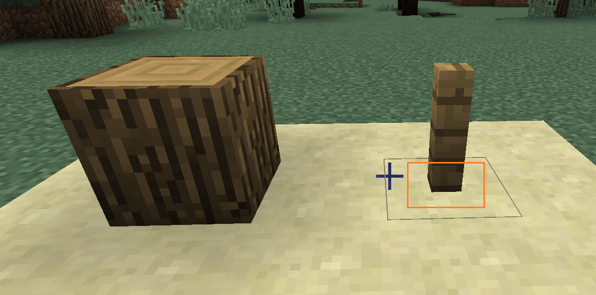

## Feb 2026
**Want To Implement:**
- Terrain meshlet double buffering
- Meshlet write → compute → fully programmable vertex pulling _(i)_
- Expand the _(i)_ pipeline to opaque/transparent/cutout
- Block udpate notify
- On demand compute; in place rewrite

**Follow-up Tasks:**
- GL test framework
- Full texture abstraction including DSA and 1D 2D 3D 2DArray etc.
- Shader debug framework including macro injection etc.

**Future To-Dos:**
- Migrate to visibility buffer for terrain rendering
- SDF AO

**Done:**
- Implement the terrain meshlet double buffering pipeline
  - 2 buffers for meshlet data read (read by compute) and write (write from cpu)
  - 2 buffers for compute data read (read by draw calls) and write (write from gpu)
- Fix terrain meshlet double buffering lifecycle issue
- Add terrain meshlet double buffering lifecycle debug hud
  
- Remove interface `I` prefix
- Implement GL junit test extensions

## March 2026
**Done:**
- Refactor & implement texture abstraction: `GLTexture` + `Accessor`
- Replace SSBO counter by uimage1D (reverted)
- Basic shader debug infra

**Want To Investigate:**
- Crash due to compute shader debug
- Why `Meshlet.blockCount == 0` for some compute shader calls
- Whether GPU side meshlet vertex/index data follow the slot layout

**3.31 Snapshot:**
- Currently working on the "On demand compute; in place rewrite"
  - In order to reduce the amount of compute shader's work, 
    meshlet vertex/index output will follow a slot memory layout 
    (`|Slot 0: data ... padding|Slot 1: ...` where every slot has the same length, so in place rewrite will be possible)
- Issue: `Meshlet.blockCount == 0` for some compute invocations while there's no empty meshlet on CPU side
- Issue: shader debug infra causes crash (system freeze) due to an unknown issue
- Need to verify that meshlet vertex/index output is working correctly and following a slot layout
- Need another SSBO to record indices to guide VS vertex pulling

## April 2026

**Debugging**:
- (i) **Actual cause**: UNKNOWN<br>
  `MeshletBufferWriteJob.execute` didn't run (due to the lack of data) for the first write task; therefore `Meshlet.blockCount == 0` for the first compute dispatch.
  However, a `write --> then --> compute` lifecycle is guaranteed. Issue might be stemmed from the ECS job related stuff.
- (ii) **Potential race condition**<br>
  `CleanWorld.update`, which is flushing the ecs commands, may run while `job.executeAsync` is running.
  As a result, archetype data may be modified while a job is reading it.
  Creating snapshots might be too expensive, so I may delay `CleanWorld.update` based on the current job status
  ```java
  if (!system1.isExecuting() && !system2.isExecuting() ...) {
      super.update();
  }
  ```
  But it looks less elegant since systems/jobs inside a `CleanWorld` will require manual managements.
  It still makes sense if we aim to provide a low level ECS. (fixed)
- **Guess**<br>
  The potential ECS race condition might be the cause of `Meshlet.blockCount == 0` but
  the empty meshlet issue only happens for the first compute dispatch. The consistency makes this thing more suspicious.
  Race conditions might not be consistent like that.
- (iii) **Guess**<br>
  Shader debug was causing system freeze and crash likely because I didn't allocate enough
  storage for buffers? Btw I shouldn't assume that debug data stay together for every frame since `append log` was called async.
- **Fixed (i)!!!**
  - Firstly, there was a common pool starvation issue that slightly pauses my ECS system flow execution.
    Now, I've switched to my dedicated fork join pool. Resolved.
  - For the empty meshlet issue, the culprit was essentially this line from `SystemExeFlowGraph`
    ```java
    /**
    * Async version of {@link #execute()}.
    */
    default CompletableFuture<Void> executeAsync(Executor executor) {
        return CompletableFuture.runAsync(this::execute, executor);
    }
    ```
    So `executing=false` is slightly delayed due to the async execution, creating a submit-start gap.
    When it comes to `MeshletGpuPipelineScheduler`
    ```java
    if (storage.get(meshletGpuRegistry).hasMeshletChanges()) {
        if (storage.get(meshletGpuRegistry).isWriting()) {
            meshletFsm.next(); // COMPUTABLE

            KirinoClientDebug.MeshletGpuTimeline$pushFrameState(MeshletGpuTimeline.State.IDLE_ALREADY_WRITING);
        } else {
            KirinoClientDebug.MeshletGpuTimeline$beginWriting();

            storage.get(meshletGpuRegistry).beginWriting();
            meshletBufferWriteSystem.executeAsync(systemFlowExecutor);
            meshletFsm.next(); // COMPUTABLE

            KirinoClientDebug.MeshletGpuTimeline$pushFrameState(MeshletGpuTimeline.State.IDLE_BEGIN_WRITING);
        }
    } else ...
    ```
    FSM advances to `COMPUTABLE` from `IDLE` immediately but `executing` is still `false` due to the submit-start gap.
    The compute system therefore thinks that the write task has finished, messing up the first compute dispatch.
    Here's the log that verifies the correctness of the fix.
    <details>
    <summary>Click to Expand</summary>

    ```log
    [01:16:27] [Client thread/INFO] [Kirino Core]: dispatch 4
    [01:16:27] [ForkJoinPool-1-worker-3/INFO] [Kirino Core]: callback start meshletBufferWriteSystem
    [01:16:27] [ForkJoinPool-1-worker-3/INFO] [Kirino Core]: callback finish meshletBufferWriteSystem
    [01:16:27] [Client thread/INFO] [Kirino Core]: ---------------------------------
    [01:16:27] [Client thread/INFO] [Kirino Core]: f00 (dirty index): 0
    [01:16:27] [Client thread/INFO] [Kirino Core]: f01 (old index count): 0
    [01:16:27] [Client thread/INFO] [Kirino Core]: f02 (old vertex count): 0
    [01:16:27] [Client thread/INFO] [Kirino Core]: f10 (first index): 0
    [01:16:27] [Client thread/INFO] [Kirino Core]: f11 (index count): 192
    [01:16:27] [Client thread/INFO] [Kirino Core]: f12 (vertex count): 128
    [01:16:27] [Client thread/INFO] [Kirino Core]: f20 (couters 0: vertex): 512
    [01:16:27] [Client thread/INFO] [Kirino Core]: f21 (couters 1: index): 768
    [01:16:27] [Client thread/INFO] [Kirino Core]: f22 (meshlet block count): 32
    [01:16:27] [Client thread/INFO] [Kirino Core]: f30 (chunk pos x): 0
    [01:16:27] [Client thread/INFO] [Kirino Core]: f31 (chunk pos y): 0
    [01:16:27] [Client thread/INFO] [Kirino Core]: f32 (chun pos z): -1
    [01:16:27] [Client thread/INFO] [Kirino Core]: f00 (dirty index): 1
    [01:16:27] [Client thread/INFO] [Kirino Core]: f01 (old index count): 0
    [01:16:27] [Client thread/INFO] [Kirino Core]: f02 (old vertex count): 0
    [01:16:27] [Client thread/INFO] [Kirino Core]: f10 (first index): 1152
    [01:16:27] [Client thread/INFO] [Kirino Core]: f11 (index count): 192
    [01:16:27] [Client thread/INFO] [Kirino Core]: f12 (vertex count): 128
    [01:16:27] [Client thread/INFO] [Kirino Core]: f20 (couters 0: vertex): 128
    [01:16:27] [Client thread/INFO] [Kirino Core]: f21 (couters 1: index): 192
    [01:16:27] [Client thread/INFO] [Kirino Core]: f22 (meshlet block count): 32
    [01:16:27] [Client thread/INFO] [Kirino Core]: f30 (chunk pos x): -1
    [01:16:27] [Client thread/INFO] [Kirino Core]: f31 (chunk pos y): 0
    [01:16:27] [Client thread/INFO] [Kirino Core]: f32 (chun pos z): 0
    [01:16:27] [Client thread/INFO] [Kirino Core]: f00 (dirty index): 2
    [01:16:27] [Client thread/INFO] [Kirino Core]: f01 (old index count): 0
    [01:16:27] [Client thread/INFO] [Kirino Core]: f02 (old vertex count): 0
    [01:16:27] [Client thread/INFO] [Kirino Core]: f10 (first index): 2304
    [01:16:27] [Client thread/INFO] [Kirino Core]: f11 (index count): 192
    [01:16:27] [Client thread/INFO] [Kirino Core]: f12 (vertex count): 128
    [01:16:27] [Client thread/INFO] [Kirino Core]: f20 (couters 0: vertex): 384
    [01:16:27] [Client thread/INFO] [Kirino Core]: f21 (couters 1: index): 576
    [01:16:27] [Client thread/INFO] [Kirino Core]: f22 (meshlet block count): 32
    [01:16:27] [Client thread/INFO] [Kirino Core]: f30 (chunk pos x): -1
    [01:16:27] [Client thread/INFO] [Kirino Core]: f31 (chunk pos y): 0
    [01:16:27] [Client thread/INFO] [Kirino Core]: f32 (chun pos z): -1
    [01:16:27] [Client thread/INFO] [Kirino Core]: f00 (dirty index): 3
    [01:16:27] [Client thread/INFO] [Kirino Core]: f01 (old index count): 0
    [01:16:27] [Client thread/INFO] [Kirino Core]: f02 (old vertex count): 0
    [01:16:27] [Client thread/INFO] [Kirino Core]: f10 (first index): 3456
    [01:16:27] [Client thread/INFO] [Kirino Core]: f11 (index count): 192
    [01:16:27] [Client thread/INFO] [Kirino Core]: f12 (vertex count): 128
    [01:16:27] [Client thread/INFO] [Kirino Core]: f20 (couters 0: vertex): 256
    [01:16:27] [Client thread/INFO] [Kirino Core]: f21 (couters 1: index): 384
    [01:16:27] [Client thread/INFO] [Kirino Core]: f22 (meshlet block count): 32
    [01:16:27] [Client thread/INFO] [Kirino Core]: f30 (chunk pos x): 0
    [01:16:27] [Client thread/INFO] [Kirino Core]: f31 (chunk pos y): 0
    [01:16:27] [Client thread/INFO] [Kirino Core]: f32 (chun pos z): 0
    ```

    </details>

**Follow-up Tasks:**
- Must provide multiple ECS runtimes since ECS flush timing is per `CleanWorld`
- Meshlets that belong to chunks outside radius=8 must be disposed immediately since
  all max buffer sizes are defined using `WORST_CASE_MESHLET_COUNT_IN_R8_16CUBIC_CHUNKS = 16384`
- Refactor `RenderExtension` & post-processing registration

Whether `GL_CLIENT_MAPPED_BUFFER_BARRIER_BIT` is needed for coherent mapped buffers?
- No
  https://community.khronos.org/t/usage-of-gl-client-mapped-buffer-barrier-bit/75355
  > If GL_MAP_COHERENT_BIT is set and the server does a write, the app must call FenceSync with GL_SYNC_GPU_COMMANDS_COMPLETE (or glFinish). Then the CPU will see the writes after the sync is complete.

Slot-allocation layout / in-place-rewrite safe layout verified:
- <details>
  <summary>Click to Expand</summary>
  
  ```log
  [22:29:20] [Client thread/INFO] [Kirino Core]: dispatch 3
  [22:29:21] [Client thread/INFO] [Kirino Core]: ---------------------------------
  [22:29:21] [Client thread/INFO] [Kirino Core]: f00 (dirty index): 0
  [22:29:21] [Client thread/INFO] [Kirino Core]: f01 (old index count): 0
  [22:29:21] [Client thread/INFO] [Kirino Core]: f02 (old vertex count): 0
  [22:29:21] [Client thread/INFO] [Kirino Core]: f10 (first index): 0
  [22:29:21] [Client thread/INFO] [Kirino Core]: f11 (index count): 192
  [22:29:21] [Client thread/INFO] [Kirino Core]: f12 (vertex count): 128
  [22:29:21] [Client thread/INFO] [Kirino Core]: f20 (couters 0: vertex): 384
  [22:29:21] [Client thread/INFO] [Kirino Core]: f21 (couters 1: index): 576
  [22:29:21] [Client thread/INFO] [Kirino Core]: f22 (meshlet block count): 32
  [22:29:21] [Client thread/INFO] [Kirino Core]: f30 (chunk pos x): 0
  [22:29:21] [Client thread/INFO] [Kirino Core]: f31 (chunk pos y): 0
  [22:29:21] [Client thread/INFO] [Kirino Core]: f32 (chun pos z): 0
  [22:29:21] [Client thread/INFO] [Kirino Core]: f00 (dirty index): 1
  [22:29:21] [Client thread/INFO] [Kirino Core]: f01 (old index count): 0
  [22:29:21] [Client thread/INFO] [Kirino Core]: f02 (old vertex count): 0
  [22:29:21] [Client thread/INFO] [Kirino Core]: f10 (first index): 1152
  [22:29:21] [Client thread/INFO] [Kirino Core]: f11 (index count): 192
  [22:29:21] [Client thread/INFO] [Kirino Core]: f12 (vertex count): 128
  [22:29:21] [Client thread/INFO] [Kirino Core]: f20 (couters 0: vertex): 128
  [22:29:21] [Client thread/INFO] [Kirino Core]: f21 (couters 1: index): 192
  [22:29:21] [Client thread/INFO] [Kirino Core]: f22 (meshlet block count): 32
  [22:29:21] [Client thread/INFO] [Kirino Core]: f30 (chunk pos x): -1
  [22:29:21] [Client thread/INFO] [Kirino Core]: f31 (chunk pos y): 0
  [22:29:21] [Client thread/INFO] [Kirino Core]: f32 (chun pos z): 0
  [22:29:21] [Client thread/INFO] [Kirino Core]: f00 (dirty index): 2
  [22:29:21] [Client thread/INFO] [Kirino Core]: f01 (old index count): 0
  [22:29:21] [Client thread/INFO] [Kirino Core]: f02 (old vertex count): 0
  [22:29:21] [Client thread/INFO] [Kirino Core]: f10 (first index): 2304
  [22:29:21] [Client thread/INFO] [Kirino Core]: f11 (index count): 192
  [22:29:21] [Client thread/INFO] [Kirino Core]: f12 (vertex count): 128
  [22:29:21] [Client thread/INFO] [Kirino Core]: f20 (couters 0: vertex): 256
  [22:29:21] [Client thread/INFO] [Kirino Core]: f21 (couters 1: index): 384
  [22:29:21] [Client thread/INFO] [Kirino Core]: f22 (meshlet block count): 32
  [22:29:21] [Client thread/INFO] [Kirino Core]: f30 (chunk pos x): -1
  [22:29:21] [Client thread/INFO] [Kirino Core]: f31 (chunk pos y): 0
  [22:29:21] [Client thread/INFO] [Kirino Core]: f32 (chun pos z): -1
  [22:29:21] [Client thread/INFO] [Kirino Core]: ---------------------------------
  [22:29:21] [Client thread/INFO] [Kirino Core]: dispatch 67
  [22:29:21] [Client thread/INFO] [Kirino Core]: ---------------------------------
  [22:29:21] [Client thread/INFO] [Kirino Core]: f00 (dirty index): 3
  [22:29:21] [Client thread/INFO] [Kirino Core]: f01 (old index count): 0
  [22:29:21] [Client thread/INFO] [Kirino Core]: f02 (old vertex count): 0
  [22:29:21] [Client thread/INFO] [Kirino Core]: f10 (first index): 3456
  [22:29:21] [Client thread/INFO] [Kirino Core]: f11 (index count): 192
  [22:29:21] [Client thread/INFO] [Kirino Core]: f12 (vertex count): 128
  [22:29:21] [Client thread/INFO] [Kirino Core]: f20 (couters 0: vertex): 1516
  [22:29:21] [Client thread/INFO] [Kirino Core]: f21 (couters 1: index): 2274
  [22:29:21] [Client thread/INFO] [Kirino Core]: f22 (meshlet block count): 32
  [22:29:21] [Client thread/INFO] [Kirino Core]: f30 (chunk pos x): 0
  [22:29:21] [Client thread/INFO] [Kirino Core]: f31 (chunk pos y): 0
  [22:29:21] [Client thread/INFO] [Kirino Core]: f32 (chun pos z): -1
  ```
  
  </details>

Index compaction pipeline is done, but only some meshlets are drawn??

```glsl
    uint actualIndex = uint(gl_VertexID);
//    uint actualIndex = drawIndices[uint(gl_VertexID)];
```
Drawing without indirection should at least draw the first meshlet but nothing was drawn.

```glsl
    uint actualIndex = drawIndices[uint(gl_VertexID % 192)];
//    uint actualIndex = drawIndices[uint(gl_VertexID)];
```
Try drawing the first meshlet. Failed.

```log
[01:14:30] [Client thread/INFO] [Kirino Core]: dispatch 1
[01:14:30] [Client thread/INFO] [Kirino Core]: buffer base id after compute (1): 9
[01:14:30] [Client thread/INFO] [Kirino Core]: buffer base id after compute (2): 11
[01:14:30] [Client thread/INFO] [Kirino Core]: buffer base id after compute (5): 13
[01:14:30] [Client thread/INFO] [Kirino Core]: buffer base id before draw (1): 9
[01:14:30] [Client thread/INFO] [Kirino Core]: buffer base id before draw (2): 11
[01:14:30] [Client thread/INFO] [Kirino Core]: buffer base id before draw (5): 13
[01:14:30] [Client thread/INFO] [Kirino Core]: dispatch 67
[01:14:30] [Client thread/INFO] [Kirino Core]: buffer base id before draw (1): 10
[01:14:30] [Client thread/INFO] [Kirino Core]: buffer base id before draw (2): 12
[01:14:30] [Client thread/INFO] [Kirino Core]: buffer base id before draw (5): 14
[01:14:30] [Client thread/INFO] [Kirino Core]: buffer base id after compute (1): 10
[01:14:30] [Client thread/INFO] [Kirino Core]: buffer base id after compute (2): 12
[01:14:30] [Client thread/INFO] [Kirino Core]: buffer base id after compute (5): 14
[01:14:30] [Client thread/INFO] [Kirino Core]: buffer base id before draw (1): 10
[01:14:30] [Client thread/INFO] [Kirino Core]: buffer base id before draw (2): 12
[01:14:30] [Client thread/INFO] [Kirino Core]: buffer base id before draw (5): 14
[01:14:30] [Client thread/INFO] [Kirino Core]: buffer base id before draw (1): 10
[01:14:30] [Client thread/INFO] [Kirino Core]: buffer base id before draw (2): 12
[01:14:30] [Client thread/INFO] [Kirino Core]: buffer base id before draw (5): 14
```

```log
[02:52:30] [Client thread/INFO] [Kirino Core]: index=0 x, y, z: 0.0, 0.0, 0.0; index redirects to 0
[02:52:30] [Client thread/INFO] [Kirino Core]: index=1 x, y, z: 0.0, 0.0, 0.0; index redirects to 1
[02:52:30] [Client thread/INFO] [Kirino Core]: index=2 x, y, z: 0.0, 0.0, 0.0; index redirects to 2
...
[02:52:30] [Client thread/INFO] [Kirino Core]: index=189 x, y, z: 0.0, 0.0, 0.0; index redirects to 189
[02:52:30] [Client thread/INFO] [Kirino Core]: index=190 x, y, z: 0.0, 0.0, 0.0; index redirects to 190
[02:52:30] [Client thread/INFO] [Kirino Core]: index=191 x, y, z: 0.0, 0.0, 0.0; index redirects to 191
[02:52:30] [Client thread/INFO] [Kirino Core]: index=192 x, y, z: 0.0, 0.0, 0.0; index redirects to 1152
[02:52:30] [Client thread/INFO] [Kirino Core]: index=193 x, y, z: 0.0, 0.0, 0.0; index redirects to 1153
```
Indirection seems fine but vertex data is just empty. (index stride=1152 elements; verified)

```log
[02:59:01] [Client thread/INFO] [Kirino Core]: index=0 x, y, z: 0.0, 0.0, 0.0; index redirects to 0; vertex index: 0
[02:59:01] [Client thread/INFO] [Kirino Core]: index=1 x, y, z: 0.0, 0.0, 0.0; index redirects to 1; vertex index: 0
[02:59:01] [Client thread/INFO] [Kirino Core]: index=2 x, y, z: 0.0, 0.0, 0.0; index redirects to 2; vertex index: 0
...
[02:59:01] [Client thread/INFO] [Kirino Core]: index=766 x, y, z: 0.0, 0.0, 0.0; index redirects to 3646; vertex index: 0
[02:59:01] [Client thread/INFO] [Kirino Core]: index=767 x, y, z: 0.0, 0.0, 0.0; index redirects to 3647; vertex index: 0
[02:59:01] [Client thread/INFO] [Kirino Core]: index=768 x, y, z: 0.0, 0.0, 0.0; index redirects to 4608; vertex index: 3072
[02:59:01] [Client thread/INFO] [Kirino Core]: index=769 x, y, z: 0.0, 0.0, 0.0; index redirects to 4609; vertex index: 3073
...
[02:59:01] [Client thread/INFO] [Kirino Core]: index=959 x, y, z: 0.0, 0.0, 0.0; index redirects to 4799; vertex index: 3196
[02:59:01] [Client thread/INFO] [Kirino Core]: index=960 x, y, z: 0.0, 0.0, 0.0; index redirects to 5760; vertex index: 3840
[02:59:01] [Client thread/INFO] [Kirino Core]: index=961 x, y, z: 0.0, 0.0, 0.0; index redirects to 5761; vertex index: 3841
```
Wrong vertex index is the cause of empty vertex data? (vertex stride=3840-3072=768 elements; verified)

Guess: regarding double buffering, I didn't copy the result of A to B after compute which breaks the dirty-based in place rewrite model.

Add double buffering ping pong copy for vertex/index output; issue resolved!

### 4.7 Summary

**Done:**
- Fixed the first-dispatch empty meshlet issue where `MeshletBufferWriteJob.execute` didn't run before compute
- Switched ECS system flow execution away from the common pool to a dedicated fork-join pool
- Fixed the `executeAsync` submit-start gap where `executing=false` could briefly remain visible after execution
- Delayed ECS flushing while async system flows are executing to avoid mutating archetype data while jobs are reading it
- Verified that `GL_CLIENT_MAPPED_BUFFER_BARRIER_BIT` is not needed for coherent mapped buffers
- Verified the slot-allocation layout for terrain meshlet vertex/index output
- Finished the index compaction / draw-index indirection pipeline
- Fixed the terrain meshlet output double-buffering issue by copying the previous vertex/index result into the next write target before dirty in-place rewrite

**Major Issues/Bugs**:
- Removing meshlets doesn't update `ranges`/`counters` in `MeshletComputeSystem`, causing stale/ghost
  meshlets to be drawn
  
- World rebuild doesn't remove meshlets, doesn't guarantee that current async tasks finished,
  doesn't reset `MeshletGpuRegistry`, doesn't reset `MeshletComputeSystem`
- Entities rendering responds to camera rotation slower (lagged). Unknown causes
- Changing render dist dynamically causes lag. Unknown causes

**Todos For Terrain Pipeline/Next Milestone**:
- Expand the pipeline to opaque/transparent/cutout
- Block update notify; reset old state; update properly
- Handle non-fullblock rendering; meshlet pipeline only handles the fullblock rendering
- Handle tile entity renderers; integrate render command pipeline

**Future**:
- SDF AO
- GI
- Low priority: chunks outside render dist=8; Another dedicated LOD solution needed

**Follow-up Tasks:**
- Verify `ChunkMeshletGenJob.fillBlockInfo` coordinate space. It currently passes 16^3 section-local
  block coordinates?
- ECS runtime ownership issue. Multiple ECS runtimes is needed because due to `flush`
- Stabilize/Finish shader debug infra
- Refactor `RenderExtension` and post-processing registration so render extension setup is less ad hoc
- Implement full texture abstraction

### SDF AO Plan
- Generate SDF occupancy grid (preferably split every voxel into 4^3 cubes; we only care about the foreground, r<=8 chunks, so it won't explode)
  - For irregular non-fullblocks, we need to generate their voxel occupancy ahead of time.
  - As a result, we'll get a nearly accurate occupancy grid of the world (static objects only)
- Create another compute pass after gbuffer to compute the per-pixel AO based on the occupancy grid;
  Not necessarily full resolution compute (could be half res; 4 times less work)
- An AO tex based on the current view is therefore generated
- Fetch data from the AO tex in frag shader

We'll therefore be able to give AO to any non-fullblock tiles, including self-occlusion and environment occlusion

Essentially addressing this vanilla AO issue.

